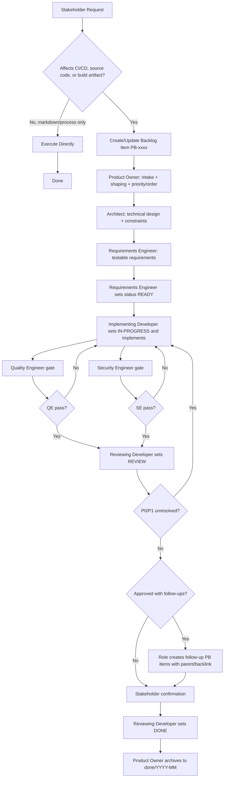
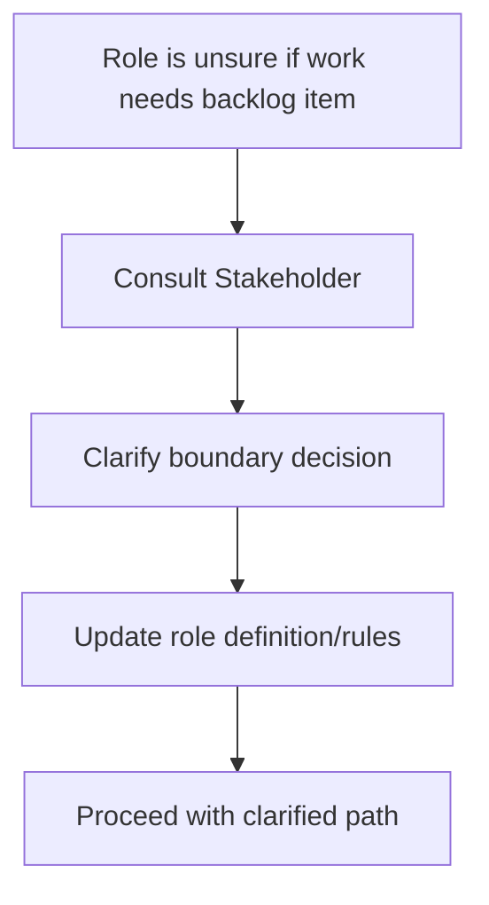
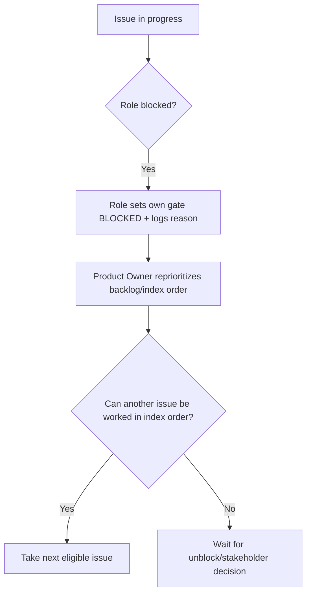

# Process Diagrams

## Happy Path

```mermaid
flowchart TD
    A[Stakeholder Request] --> B{Affects CI/CD, source code, or build artifact?}
    B -->|Yes| C[Create/Update Backlog Item PB-xxxx]
    B -->|No, markdown/process only| D[Execute Directly]
    D --> E[Done]

    C --> F[Product Owner: intake + shaping + priority/order]
    F --> G[Architect: technical design + constraints]
    G --> H[Requirements Engineer: testable requirements]
    H --> I[Requirements Engineer sets status READY]
    I --> J[Implementing Developer sets IN-PROGRESS and implements]
    J --> K[Quality Engineer gate]
    J --> L[Security Engineer gate]
    K --> M{QE pass?}
    L --> N{SE pass?}
    M -->|No| J
    N -->|No| J
    M -->|Yes| O[Reviewing Developer sets REVIEW]
    N -->|Yes| O
    O --> P{P0/P1 unresolved?}
    P -->|Yes| J
    P -->|No| Q{Approved with follow-ups?}
    Q -->|Yes| R[Role creates follow-up PB items with parent/backlink]
    Q -->|No| S[Stakeholder confirmation]
    R --> S
    S --> T[Reviewing Developer sets DONE]
    T --> U[Product Owner archives to done/YYYY-MM]
```

## Boundary Clarification Edge Case

```mermaid
flowchart TD
    A[Role is unsure if work needs backlog item] --> B[Consult Stakeholder]
    B --> C[Clarify boundary decision]
    C --> D[Update role definition/rules]
    D --> E[Proceed with clarified path]
```

## Blocking and Reordering Edge Case

```mermaid
flowchart TD
    A[Issue in progress] --> B{Role blocked?}
    B -->|Yes| C[Role sets own gate BLOCKED + logs reason]
    C --> D[Product Owner reprioritizes backlog/index order]
    D --> E{Can another issue be worked in index order?}
    E -->|Yes| F[Take next eligible issue]
    E -->|No| G[Wait for unblock/stakeholder decision]
```
